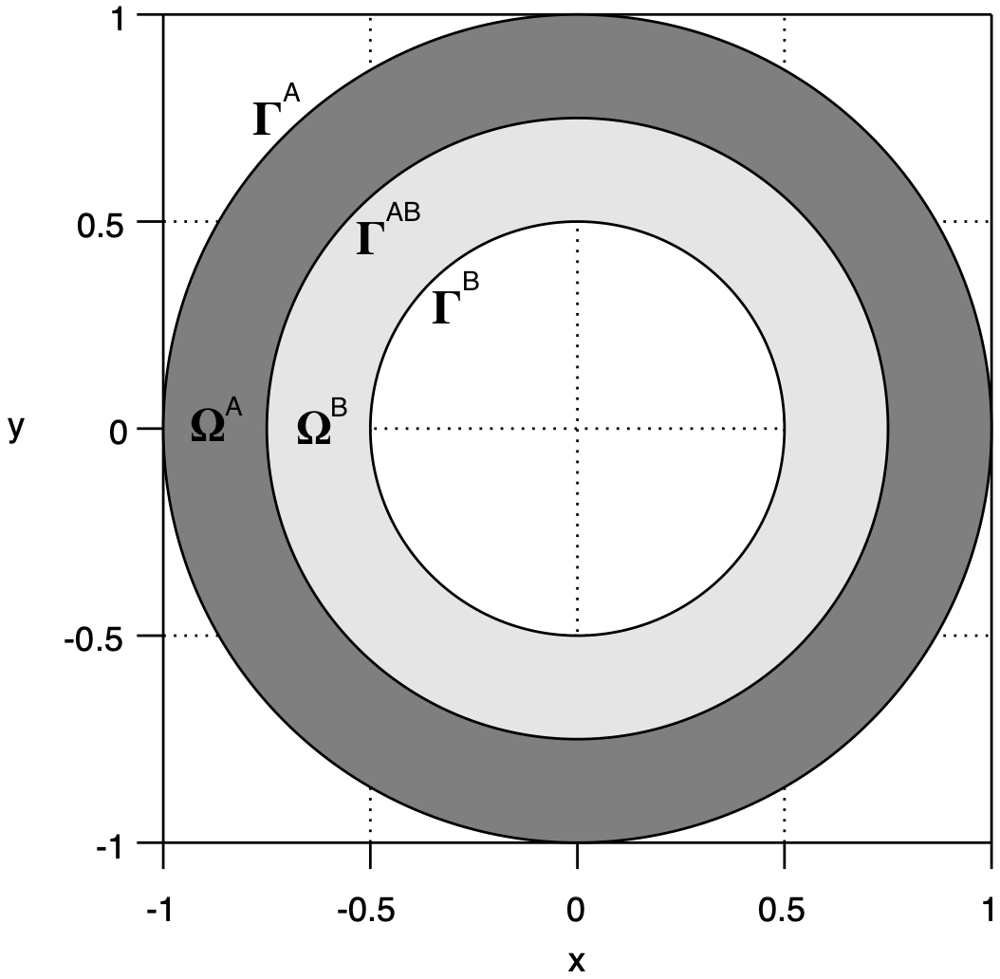
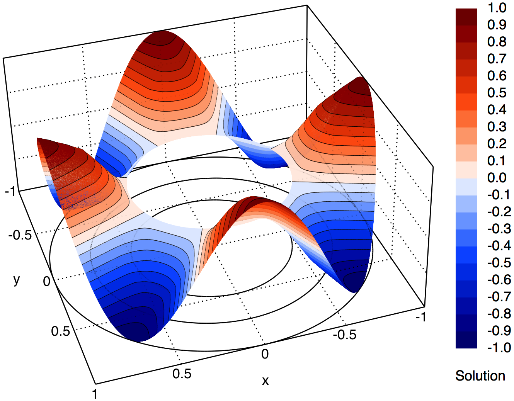
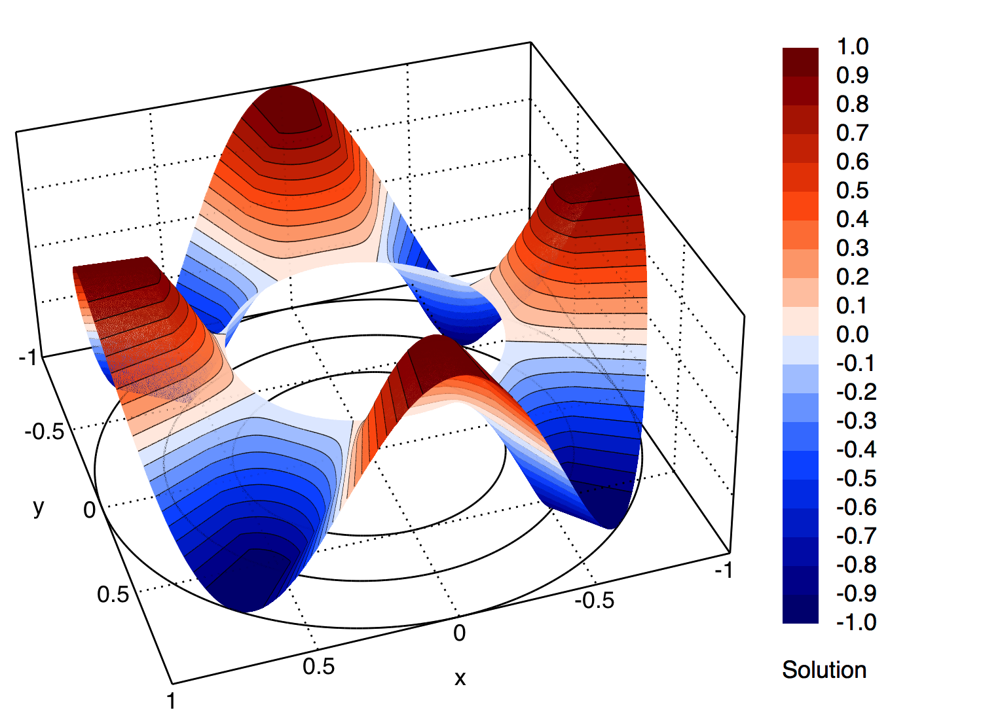

# [CHT_01] Circular interface with continuity interface conditions

## 1. Summary

This benchmark represents a **steady-state conjugate heat transfer** problem in a concentric circular domain divided into two regions with different thermal conductivities. The case is based on a **manufactured analytical solution** in polar coordinates, enabling:
- **Code verification** of conduction and convection numerical schemes.
- **Numerical assessment** of interface treatments (solution continuity and flux conservation).
- **Testing** of cylindrical structured and unstructured meshes generation.

It is particularly suitable for solvers that support **multi-material conduction** with optional tangential advection.

## 2. Domain and meshes

The **domain**, $\Omega$, consists of an outer and inner concentric circular boundaries, $\Gamma^{\textrm{A}}$ and $\Gamma^{\textrm{B}}$, respectively, centered at the origin and with radius $r^{\textrm{A}}$ and $r^{\textrm{B}}$, respectively.
An interface, $\Gamma^{\textrm{AB}}$, with radius $r^{\textrm{AB}}$, divides the domain into two subdomains, $\Omega^{\textrm{A}}$ and $\Omega^{\textrm{B}}$, corresponding to the outer and inner regions, respectively.

<div align="center">
  <table>
    <tr>
      <td align="center"></td>
      <td align="center"></td>
    </tr>
    <tr>
      <td align="center">Domain and notation.</td>
      <td align="center">Unstructured triangular mesh.</td>
    </tr>
  </table>
</div>

Structured quadrilateral and unstructured triangular meshes with matching nodes on the interface are provided to discretise both subdomains. A local mesh refinement to accommodate the different boundary/interface curvatures is considered.

## 3. Model problem

The **steady-state conjugate heat transfer problem** reads: seek temperature distribution functions $\phi^{\textrm{A}}$ and $\phi^{\textrm{B}}$ such that

$$
\begin{array}{l}
&\nabla\cdot\left(\boldsymbol{u}^{\textrm{A}}\phi^{\textrm{A}}\right)-\alpha^{\textrm{A}}\nabla^{2}\phi^{\textrm{A}}=f^{\textrm{A}},&\quad\textrm{in }\Omega^{\textrm{A}},\\
&\nabla\cdot\left(\boldsymbol{u}^{\textrm{B}}\phi^{\textrm{B}}\right)-\alpha^{\textrm{B}}\nabla^{2}\phi^{\textrm{B}}=f^{\textrm{B}},&\quad\textrm{in }\Omega^{\textrm{B}},\\
\end{array}
$$

where $\alpha^{\textrm{A}}$ and $\alpha^{\textrm{B}}$ are constant thermal diffusivities, $\boldsymbol{u}^{\textrm{A}}$ and $\boldsymbol{u}^{\textrm{B}}$ are velocity field functions, and $f^{\textrm{A}}$ and $f^{\textrm{B}}$ are source-term functions in subdomains $\Omega^{\textrm{A}}$ and $\Omega^{\textrm{B}}$, respectively.

The **velocity fields** are chosen to be tangential to the boundaries and interface and, in polar coordinates $\left(r,\theta\right)$, read

$$
\begin{array}{ll}
\boldsymbol{u}^{\textrm{A}}\left(r,\theta\right)=\omega^{\textrm{A}}r
\begin{bmatrix}
-\sin\left(\theta\right)\\
\cos\left(\theta\right)
\end{bmatrix},
&\quad\textrm{in }\Omega^{\textrm{A}},\\
\boldsymbol{u}^{\textrm{B}}\left(r,\theta\right)=\omega^{\textrm{B}}r
\begin{bmatrix}
-\sin\left(\theta\right)\\
\cos\left(\theta\right)
\end{bmatrix},
&\quad\textrm{in }\Omega^{\textrm{B}},
\end{array}
$$

where $\omega^{\textrm{A}},\omega^{\textrm{B}}\in\mathbb{R}$ are chosen constant parameters that control the angular velocity magnitude.

## 4. Manufactured solution

The **manufactured solutions**, in polar coordinates $\left(r,\theta\right)$, read

$$
\begin{array}{l}
&\phi^{\textrm{A}}\left(r,\theta\right)=\left(a^{\textrm{A}}\ln\left(r\right)+b^{\textrm{A}}\right)\cos\left(n\theta\right),&\quad\textrm{in }\Omega^{\textrm{A}},\\
&\phi^{\textrm{B}}\left(r,\theta\right)=\left(a^{\textrm{B}}\ln\left(r\right)+b^{\textrm{B}}\right)\cos\left(n\theta\right),&\quad\textrm{in }\Omega^{\textrm{B}},
\end{array}
$$

where $n\in\mathbb{R}$ is a chosen constant parameter that control the solution mode number, and $a^{\textrm{A}},a^{\textrm{B}},b^{\textrm{A}},b^{\textrm{B}}\in\mathbb{R}$ are determined constant parameters to enforce boundary and interface conditions.

<div align="center">
  <table>
    <tr>
      <td align="center"></td>
      <td align="center"></td>
    </tr>
    <tr>
      <td align="center">Manufactured solution in the low-diffusivity ratio case.</td>
      <td align="center">Manufactured solution in the high-diffusivity ratio case.</td>
    </tr>
  </table>
</div>

On the outer and inner boundaries, **periodic and homogeneous Dirichlet boundary conditions** are prescribed, respectively, and, in polar coordinates $\left(r,\theta\right)$, read

$$
\begin{array}{l}
&\phi^{\textrm{A}}\left(r,\theta\right)=\cos\left(n^{\textrm{A}}\theta\right),&\quad\textrm{on }\Gamma^{\textrm{A}},\\
&\phi^{\textrm{B}}\left(r,\theta\right)=0,&\quad\textrm{on }\Gamma^{\textrm{B}}.
\end{array}
$$

On the interface, the **solution continuity and the conservation of conductive fluxes** are prescribed, that is

$$
\begin{array}{l}
&\phi^{\textrm{A}}\left(r,\theta\right)=\phi^{\textrm{B}}\left(r,\theta\right),&\quad\textrm{on }\Gamma^{\textrm{AB}},\\
&-\alpha^{\textrm{A}}\nabla\phi^{\textrm{A}}\left(r,\theta\right)\cdot\boldsymbol{n}^{\textrm{A}}\left(r,\theta\right)-\alpha^{\textrm{B}}\nabla\phi^{\textrm{B}}\left(r,\theta\right)\cdot\boldsymbol{n}^{\textrm{B}}\left(r,\theta\right)=0,&\quad\textrm{on }\Gamma^{\textrm{AB}}.
\end{array}
$$

Parameters $a^{\textrm{A}}$, $a^{\textrm{B}}$, $b^{\textrm{A}}$, and $b^{\textrm{B}}$ in the analytical solution are determined such that boundary and interface conditions are simultaneously satisfied, and read

$$
\begin{array}{l}
a^{\textrm{A}}=c\alpha^{\textrm{B}},\\
a^{\textrm{B}}=c\alpha^{\textrm{A}},\\
b^{\textrm{A}}=c\left(\alpha^{\textrm{A}}\ln\left(\dfrac{r^{\textrm{AB}}}{r^{\textrm{B}}}\right)-\alpha^{\textrm{B}}\ln\left(r^{\textrm{AB}}\right)\right),\\
b^{\textrm{B}}=-c\alpha^{\textrm{A}}\ln\left(r^{\textrm{B}}\right),\\
c=\left(\alpha^{\textrm{A}}\ln\left(\dfrac{r^{\textrm{AB}}}{r^{\textrm{B}}}\right)+\alpha^{\textrm{B}}\ln\left(\dfrac{r^{\textrm{A}}}{r^{\textrm{AB}}}\right)\right)^{-1}.
\end{array}
$$

The **source-terms**, in polar coordinates $\left(r,\theta\right)$, read

$$
\begin{array}{ll}
&f^{\textrm{A}}\left(r,\theta\right)=\dfrac{\alpha^{\textrm{A}}\left(n^{\textrm{A}}\right)^{2}\cos\left(n^{\textrm{A}}\theta\right)\left(a^{\textrm{A}}\ln\left(r\right)+b^{\textrm{A}}\right)}{r^{2}}-n^{\textrm{A}}\omega^{\textrm{A}}\sin\left(n^{\textrm{A}}\theta\right)\left(a^{\textrm{A}}\ln\left(r\right)+b^{\textrm{A}}\right),&\quad\textrm{in }\Omega^{\textrm{A}},\\
&f^{\textrm{B}}\left(r,\theta\right)=\dfrac{\alpha^{\textrm{B}}\left(n^{\textrm{B}}\right)^{2}\cos\left(n^{\textrm{B}}\theta\right)\left(a^{\textrm{B}}\ln\left(r\right)+b^{\textrm{B}}\right)}{r^{2}}-n^{\textrm{B}}\omega^{\textrm{B}}\sin\left(n^{\textrm{B}}\theta\right)\left(a^{\textrm{B}}\ln\left(r\right)+b^{\textrm{B}}\right),&\quad\textrm{in }\Omega^{\textrm{B}}.
\end{array}
$$

## 5. Case parameters

The table below summarises the configurable parameters and the recommended values for two case configurations: a low-diffusivity ratio ($\alpha^{\textrm{A}}/\alpha^{\textrm{B}}=2$) and a high-diffusivity ratio ($\alpha^{\textrm{A}}/\alpha^{\textrm{B}}=100$).

| Symbol                    | Description                                                       | Value (low-diffusivity ratio) | Value (high-diffusivity ratio) |
|:--------------------------|:------------------------------------------------------------------|------------------------------:|-------------------------------:|
| $r^{\textrm{A}}$          | Radius of outer boundary, $\Gamma^{\textrm{A}}$                   | 1.0                           | 1.0                            |
| $r^{\textrm{AB}}$         | Radius of interface, $\Gamma^{\textrm{AB}}$                       | 0.75                          | 0.75                           |
| $r^{\textrm{B}}$          | Radius of inner boundary, $\Gamma^{\textrm{B}}$                   | 0.5                           | 0.5                            |
| $\alpha^{\textrm{A}}$     | Thermal diffusivity in outer subdomain, $\Omega^{\textrm{A}}$     | 2.0                           | 100.0                          |
| $\alpha^{\textrm{B}}$     | Thermal diffusivity in inner subdomain, $\Omega^{\textrm{B}}$     | 1.0                           | 1.0                            |
| $\omega^{\textrm{A}}$     | Angular velocity in outer subdomain, $\Omega^{\textrm{A}}$        | 1.0                           | 1.0                            |
| $\omega^{\textrm{B}}$     | Angular velocity in inner subdomain, $\Omega^{\textrm{B}}$        | -1.0                          | -1.0                           |
| $n$                       | Solution mode number                                              | 4                             | 4                              |

## 6. Scripts and files

The table below summarises the functionality and usage of the provided scripts. Check script headers for requirements and dependencies.

| File                        | Description                                                                     | Usage (command-line)          |
|:----------------------------|:--------------------------------------------------------------------------------|:------------------------------|
| `generate_quadmesh.msh` | Generates quadrilateral structured meshes in MSH format. Mesh refinement can be controlled through the command-line option `-setnumber N <value>` where `<value>` is a numerical argument specifying the desired refinement level (default: `1`). Outputs are saved in `meshes/`. | `gmsh -setnumber N 1 generate_quadmesh.msh` |
| `generate_triamesh.msh` | Generates triangular unstructured meshes in MSH format. Mesh refinement can be controlled through the command-line option `-setnumber N <value>` where `<value>` is a numerical argument specifying the desired refinement level (default: `1`). Outputs are saved in `meshes/`. | `gmsh -setnumber N 1 generate_triamesh.msh` |
| `generate_code.py` | Generates code for the symbolic expressions of parameters and functions in multiple programming languages: C/C++, Fortran, Octave/Matlab, and Python. Outputs are saved in `codes/`. | `python generate_code.py` |
| `helpers.py` | Utility functions for code generation in multiple programming languages: C/C++, Fortran, Octave/Matlab, and Python. Includes code formatting and line-wrapping helpers to keep generated source code within a configurable indent and line width. | |
    
## 7. How to cite

If you use this benchmark or any of the provided material, in its original or modified form, in your research, please acknowledge the original work in your publications by citing:

> **R. Costa**, J.M. Nóbrega, S. Clain, and G.J. Machado, _Very high-order accurate polygonal mesh finite volume scheme for conjugate heat transfer problems with curved interfaces and imperfect contacts_, **Computer Methods in Applied Mechanics and Engineering**, Vol. 357, 112560, 2019. DOI: [10.1016/j.cma.2019.07.029](https://doi.org/10.1016/j.cma.2019.07.029).

You may use the following BibTeX entry:

```bibtex
@article{Costa2019,
  title={Very high-order accurate polygonal mesh finite volume scheme for conjugate heat transfer problems with curved interfaces and imperfect contacts},
  author={Costa, R. and Nóbrega, J. M. and Clain, S. and Machado, G. J.},
  journal={Computer Methods in Applied Mechanics and Engineering},
  volume={357},
  pages={112560},
  year={2019},
  doi={10.1016/j.cma.2019.07.029}
}
