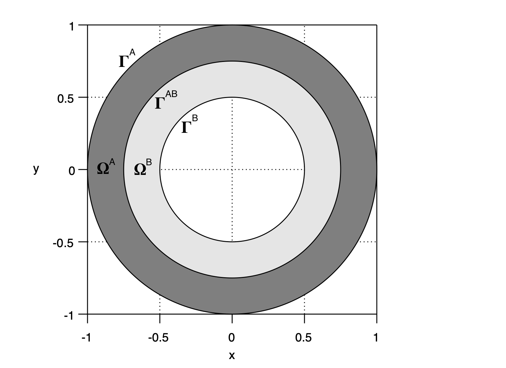

# Circular interface with continuity interface conditions (CHT_01)

## Summary

This benchmark represents a **steady-state conjugate heat transfer** problem in a concentric circular domain divided into two regions with different thermal conductivities. The case is based on a **manufactured analytical solution** in polar coordinates, enabling:
- **Code verification** of conduction and convection numerical schemes.
- **Validation** of interface treatments (solution continuity and flux conservation).
- **Testing** of cylindrical structured and unstructured mesh generation and handling.

It is particularly suitable for solvers that support **multi-material conduction** with optional tangential advection.

## Domain

The **domain**, $\Omega$, consists of an outer and inner concentric circular boundaries, $\Gamma^{\textrm{A}}$ and $\Gamma^{\textrm{B}}$, respectively, centered at the origin and with radius $r_{\textrm{O}}$ and $r_{\textrm{I}}$, respectively.
An interface, $\Gamma^{\textrm{AB}}$, with radius $r_{\textrm{M}}$, divides the domain into two subdomains, $\Omega^{\textrm{A}}$ and $\Omega^{\textrm{B}}$, corresponding to the outer and inner annulus.

  

 
## Properties

Constant thermal conductivities, $\kappa^{\textrm{A}}$ and $\kappa^{\textrm{B}}$, are considered in subdomains $\Omega^{\textrm{A}}$ and $\Omega^{\textrm{B}}$, respectively.

## Formulation

### Manufactured solution

The **manufactured solution**, in polar coordinates $\left(r,\theta\right)$, reads

$$
\begin{array}{l}
&\phi^{\textrm{A}}\left(r,\theta\right)=\left(a^{\textrm{A}}\ln\left(r\right)+b^{\textrm{A}}\right)\cos\left(n^{\textrm{A}}\theta\right),&\quad\textrm{in }\Omega^{\textrm{A}},\\
&\phi^{\textrm{B}}\left(r,\theta\right)=\left(a^{\textrm{B}}\ln\left(r\right)+b^{\textrm{B}}\right)\cos\left(n^{\textrm{B}}\theta\right),&\quad\textrm{in }\Omega^{\textrm{B}},
\end{array}
$$

where $n^{\textrm{A}},n^{\textrm{B}}\in\mathbb{R}$ are parameters to choose and $a^{\textrm{A}},a^{\textrm{B}},b^{\textrm{A}},b^{\textrm{B}}\in\mathbb{R}$ are parameters to determine.

  

### Boundary and interface conditions

On the outer and inner boundaries, **periodic and homogeneous Dirichlet boundary conditions** are prescribed, respectively, and, in polar coordinates $\left(r,\theta\right)$, read

$$
\begin{array}{l}
&\phi^{\textrm{A}}\left(r,\theta\right)=\cos\left(n^{\textrm{A}}\theta\right),&\quad\textrm{on }\Gamma^{\textrm{A}},\\
&\phi^{\textrm{B}}\left(r,\theta\right)=0,&\quad\textrm{on }\Gamma^{\textrm{B}}.
\end{array}
$$

On the interface, the **solution continuity and the conservation of conductive fluxes** are prescribed, that is

$$
\begin{array}{l}
&\phi^{\textrm{A}}\left(r,\theta\right)=\phi^{\textrm{B}}\left(r,\theta\right),&\quad\textrm{on }\Gamma^{\textrm{AB}},\\
&-\kappa^{\textrm{A}}\nabla\phi^{\textrm{A}}\left(r,\theta\right)\cdot\boldsymbol{n}^{\textrm{A}}\left(r,\theta\right)-\kappa^{\textrm{B}}\nabla\phi^{\textrm{B}}\left(r,\theta\right)\cdot\boldsymbol{n}^{\textrm{B}}\left(r,\theta\right)=0,&\quad\textrm{on }\Gamma^{\textrm{AB}}.
\end{array}
$$

Parameters $a^{\textrm{A}}$, $a^{\textrm{B}}$, $b^{\textrm{A}}$, and $b^{\textrm{B}}$ in the analytical solution are determined such that boundary and interface conditions are simultaneously satisfied, and read

$$
\begin{array}{l}
a^{\textrm{A}}=-c\kappa^{\textrm{B}},\\
a^{\textrm{B}}=-c\kappa^{\textrm{A}},\\
b^{\textrm{A}}=c\left(\kappa^{\textrm{A}}\ln\left(\dfrac{r_{\textrm{I}}}{r_{\textrm{M}}}\right)+\kappa^{\textrm{B}}\ln\left(r_{\textrm{M}}\right)\right),\\
b^{\textrm{B}}=c\kappa^{\textrm{A}}\ln\left(r_{\textrm{I}}\right),\\
c=\left(\kappa^{\textrm{A}}\ln\left(\dfrac{r_{\textrm{I}}}{r_{\textrm{M}}}\right)+\kappa^{\textrm{B}}\ln\left(\dfrac{r_{\textrm{M}}}{r_{\textrm{O}}}\right)\right)^{-1}.
\end{array}
$$

### Velocity field

The **velocity field**, tangential to the boundaries and interface, in polar coordinates $\left(r,\theta\right)$, reads

$$
\begin{array}{ll}
\boldsymbol{u}^{\textrm{A}}\left(r,\theta\right)=\omega^{\textrm{A}}r\begin{bmatrix}-\sin\left(\theta\right)\\\cos\left(\theta\right)\end{bmatrix},&\quad\textrm{in }\Omega^{\textrm{A}},\\
\boldsymbol{u}^{\textrm{B}}\left(r,\theta\right)=\omega^{\textrm{B}}r\begin{bmatrix}-\sin\left(\theta\right)\\\cos\left(\theta\right)\end{bmatrix},&\quad\textrm{in }\Omega^{\textrm{B}},
\end{array}
$$

where $\omega^{\textrm{A}},\omega^{\textrm{B}}\in\mathbb{R}$ are parameters to choose.

### Source term

The **source term**, in polar coordinates $\left(r,\theta\right)$, reads

$$
\begin{array}{ll}
&f^{\textrm{A}}\left(r,\theta\right)=\dfrac{\kappa^{\textrm{A}}\left(n^{\textrm{A}}\right)^{2}\cos\left(n^{\textrm{A}}\theta\right)\left(a^{\textrm{A}}\ln\left(r\right)+b^{\textrm{A}}\right)}{r^{2}}-n^{\textrm{A}}\omega^{\textrm{A}}\sin\left(n^{\textrm{A}}\theta\right)\left(a^{\textrm{A}}\ln\left(r\right)+b^{\textrm{A}}\right),&\quad\textrm{in }\Omega^{\textrm{A}},\\
&f^{\textrm{B}}\left(r,\theta\right)=\dfrac{\kappa^{\textrm{B}}\left(n^{\textrm{B}}\right)^{2}\cos\left(n^{\textrm{B}}\theta\right)\left(a^{\textrm{B}}\ln\left(r\right)+b^{\textrm{B}}\right)}{r^{2}}-n^{\textrm{B}}\omega^{\textrm{B}}\sin\left(n^{\textrm{B}}\theta\right)\left(a^{\textrm{B}}\ln\left(r\right)+b^{\textrm{B}}\right),&\quad\textrm{in }\Omega^{\textrm{B}}.
\end{array}
$$

> **Note:** the analytical functions can be easily transformed from polar to Cartesian coordinates with $r^{2}=x^{2}+y^{2}$ and $\theta=\arctan\left(y/x\right)$.

## Default Parameters

| Symbol         | Description                                                | Default Value |
|----------------|------------------------------------------------------------|--------------:|
| $r_O$          | Radius of outer boundary $\Gamma^{\textrm{A}}$             | 1.0           |
| $r_M$          | Radius of interface $\Gamma^{\textrm{AB}}$                 | 0.5           |
| $r_I$          | Radius of inner boundary $\Gamma^{\textrm{B}}$             | 0.2           |
| $\kappa^A$     | Conductivity in outer subdomain $\Omega^{\textrm{A}}$      | 2.0           |
| $\kappa^B$     | Conductivity in inner subdomain $\Omega^{\textrm{B}}$      | 1.0           |
| $n^A$          | Mode number in $\Omega^{\textrm{A}}$                       | 4             |
| $n^B$          | Mode number in $\Omega^{\textrm{B}}$                       | 4             |
| $\omega^A$     | Angular velocity in $\Omega^{\textrm{A}}$                  | 1.0           |
| $\omega^B$     | Angular velocity in $\Omega^{\textrm{B}}$                  | -1.0          |

## Meshes

  

## 8. Files & Resources

| File                  | Description                                   |
|-----------------------|-----------------------------------------------|
| `CHT_01_description.md` | This document (case definition)             |
| `exact_solution.py`   | Python script for $\phi$, $\mathbf{u}$, and $f$ in Cartesian coordinates |
| `mesh.msh`            | Gmsh mesh file                                |
| `images/*.png`        | Figures for documentation                     |

