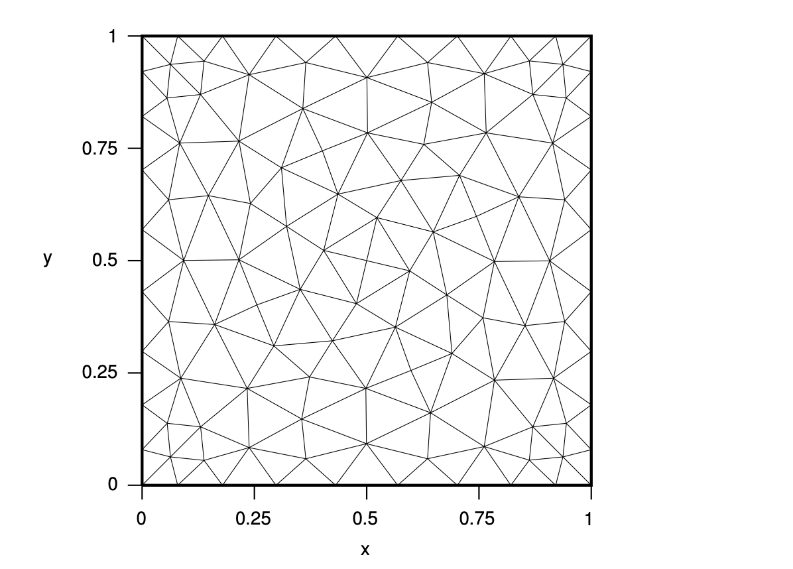

# [IFF_01] Taylor-Green flow of decaying vortices

## 1. Summary

This benchmark represents an **unsteady two-dimensional isothermal incompressible fluid flow** problem in a square domain with decaying vortices. It is particularly suitable for solvers of the **unsteady Navier-Stokes equations** with solenoidal velocity fields. The case is based on an **exact analytical solution**, enabling:
- **Code verification** of numerical schemes for the Navier-Stokes equations.
- **Numerical assessment** of the incompressibility constraint and non-linear terms.
- **Convergence analysis** on structured and unstructured meshes.

## 2. Domain and meshes

The flow is periodic with repeating counter-rotating vortices in both directions, such that a square domain $\Omega=\left[0,L\right]^{2}$ of length $L$ is considered and $\Gamma$ stands for its boundary.

<div align="center">
  <table>
    <tr>
      <td align="center"></td>
      <td align="center"></td>
      <td align="center"></td>
    </tr>
    <tr>
      <td align="center">Domain and notation.</td>
      <td align="center">Structured quadrilateral mesh.</td>
      <td align="center">Unstructured triangular mesh.</td>
    </tr>
  </table>
</div>

**Structured quadrilateral** and **unstructured triangular meshes** with uniform mesh characteristic size are supplied to discretise both subdomains.

## 3. Model problem

The **unsteady two-dimensional isothermal incompressible fluid flow** problem is modelled with the **Navier-Stokes equations** equipped with the appropriate boundary conditions, and reads: seek pressure and velocity functions, $p$ and $\boldsymbol{u}$, respectively, such that

$$
\begin{array}{l}
&\dfrac{\partial\boldsymbol{u}}{\partial t}+\left(\boldsymbol{u}\cdot\nabla)\boldsymbol{u}-\nu\nabla^{2}\boldsymbol{u}+\dfrac{1}{\rho}\nabla p=\boldsymbol{f},&\quad\textrm{in }\Omega,\\
&\nabla\cdot\boldsymbol{u}=0,&\quad\textrm{in }\Omega,
$$

where $\nu$ is a given constant kinetic viscosity, $\rho$ is a given constant density, and $\boldsymbol{f}$ is a source term function in $\Omega$.

## 4. Manufactured solution

The **manufactured solutions** read

$$
\begin{array}{l}
&\phi^{\textrm{A}}\left(r,\theta\right)=\left(a^{\textrm{A}}\ln\left(r\right)+b^{\textrm{A}}\right)\cos\left(n\theta\right),&\quad\textrm{in }\Omega^{\textrm{A}},\\
&\phi^{\textrm{B}}\left(r,\theta\right)=\left(a^{\textrm{B}}\ln\left(r\right)+b^{\textrm{B}}\right)\cos\left(n\theta\right),&\quad\textrm{in }\Omega^{\textrm{B}},
\end{array}
$$

where $n$ is a given constant parameter to control the solutions mode number (angular complexity), and $a^{\textrm{A}}$, $a^{\textrm{B}}$, $b^{\textrm{A}}$, and $b^{\textrm{B}}$ are constant parameters to enforce boundary and interface conditions.

<div align="center">
  <table>
    <tr>
      <td align="center"></td>
      <td align="center"></td>
    </tr>
    <tr>
      <td align="center">Manufactured solutions in the low-diffusivity ratio case.</td>
      <td align="center">Manufactured solutions in the high-diffusivity ratio case.</td>
    </tr>
  </table>
</div>

The **velocity fields** are purely rotational, such that no mass transfer occurs through the boundaries and interface, and read

$$
\begin{array}{ll}
&\boldsymbol{u}^{\textrm{A}}\left(r,\theta\right)=\omega^{\textrm{A}}r\hspace{1pt}\hat{\boldsymbol{\theta}},&\quad\textrm{in }\Omega^{\textrm{A}},\\
&\boldsymbol{u}^{\textrm{B}}\left(r,\theta\right)=\omega^{\textrm{B}}r\hspace{1pt}\hat{\boldsymbol{\theta}},&\quad\textrm{in }\Omega^{\textrm{B}},
\end{array}
$$

<div align="center">
  <table>
    <tr>
      <td align="center"></td>
    </tr>
    <tr>
      <td align="center">Velocity fields.</td>
    </tr>
  </table>
</div>

where $\omega^{\textrm{A}}$ and $\omega^{\textrm{B}}$ are given constant parameters to control the angular velocity.

The **source terms** read

$$
\begin{array}{ll}
&f^{\textrm{A}}\left(r,\theta\right)=\dfrac{n\left(a^{\textrm{A}}\ln\left(r\right)+b^{\textrm{A}}\right)\left(\alpha^{\textrm{A}}n\cos\left(n\theta\right)-r^{2}\omega^{\textrm{A}}\sin\left(n\theta\right)\right)}{r^{2}},&\quad\textrm{in }\Omega^{\textrm{A}},\\
&f^{\textrm{B}}\left(r,\theta\right)=\dfrac{n\left(a^{\textrm{B}}\ln\left(r\right)+b^{\textrm{B}}\right)\left(\alpha^{\textrm{B}}n\cos\left(n\theta\right)-r^{2}\omega^{\textrm{B}}\sin\left(n\theta\right)\right)}{r^{2}},&\quad\textrm{in }\Omega^{\textrm{B}},\\
\end{array}
$$

which are obtained by substituting the manufactured solutions into the governing equations in polar coordinates.

<div align="center">
  <table>
    <tr>
      <td align="center"></td>
      <td align="center"></td>
    </tr>
    <tr>
      <td align="center">Source-terms in the low-diffusivity ratio case.</td>
      <td align="center">Source-terms in the high-diffusivity ratio case.</td>
    </tr>
  </table>
</div>

The **boundary conditions** correspond to the **periodic solution** on the outer boundary and the **homogeneous solution** on the inner boundary, that is

$$
\begin{array}{l}
&\phi^{\textrm{A}}=\cos\left(n\theta\right),&\quad\textrm{on }\Gamma^{\textrm{A}},\\
&\phi^{\textrm{B}}=0,&\quad\textrm{on }\Gamma^{\textrm{B}}.
\end{array}
$$

The **interface conditions** correspond to the **solution continuity** and the **conservation of diffusive fluxes** on the interface, that is

$$
\begin{array}{l}
&\phi^{\textrm{A}}=\phi^{\textrm{B}},&\quad\textrm{on }\Gamma^{\textrm{AB}},\\
&-\alpha^{\textrm{A}}\nabla\phi^{\textrm{A}}\cdot\boldsymbol{n}^{\textrm{A}}=-\alpha^{\textrm{B}}\nabla\phi^{\textrm{B}}\cdot\boldsymbol{n}^{\textrm{AB}},&\quad\textrm{on }\Gamma^{\textrm{AB}}.
\end{array}
$$

Parameters $a^{\textrm{A}}$, $a^{\textrm{B}}$, $b^{\textrm{A}}$, and $b^{\textrm{B}}$ in the analytical solutions are determined such that boundary and interface conditions are simultaneously satisfied, and read

$$
a^{\textrm{A}}=c\alpha^{\textrm{B}},\qquad
a^{\textrm{B}}=c\alpha^{\textrm{A}},\qquad
b^{\textrm{A}}=c\left(\alpha^{\textrm{A}}\ln\left(\dfrac{r^{\textrm{AB}}}{r^{\textrm{B}}}\right)-\alpha^{\textrm{B}}\ln\left(r^{\textrm{AB}}\right)\right),\qquad
b^{\textrm{B}}=-c\alpha^{\textrm{A}}\ln\left(r^{\textrm{B}}\right),\qquad
c=\left(\alpha^{\textrm{A}}\ln\left(\dfrac{r^{\textrm{AB}}}{r^{\textrm{B}}}\right)+\alpha^{\textrm{B}}\ln\left(\dfrac{r^{\textrm{A}}}{r^{\textrm{AB}}}\right)\right)^{-1}.
$$

## 5. Case parameters

The table below summarises the given constant parameters and the recommended values for two case configurations: a low-diffusivity ratio ($\alpha^{\textrm{A}}/\alpha^{\textrm{B}}=2$) and a high-diffusivity ratio ($\alpha^{\textrm{A}}/\alpha^{\textrm{B}}=100$).

| Symbol                    | Description                                                       | Value (low-diffusivity ratio) | Value (high-diffusivity ratio) | Units              |
|:--------------------------|:------------------------------------------------------------------|------------------------------:|-------------------------------:|:-------------------|
| $r^{\textrm{A}}$          | Radius of outer boundary, $\Gamma^{\textrm{A}}$                   | 1.0                           | 1.0                            | m                  |
| $r^{\textrm{AB}}$         | Radius of interface, $\Gamma^{\textrm{AB}}$                       | 0.75                          | 0.75                           | m                  |
| $r^{\textrm{B}}$          | Radius of inner boundary, $\Gamma^{\textrm{B}}$                   | 0.5                           | 0.5                            | m                  |
| $\alpha^{\textrm{A}}$     | Thermal diffusivity in outer subdomain, $\Omega^{\textrm{A}}$     | 2.0                           | 100.0                          | m<sup>2</sup>/s    |
| $\alpha^{\textrm{B}}$     | Thermal diffusivity in inner subdomain, $\Omega^{\textrm{B}}$     | 1.0                           | 1.0                            | m<sup>2</sup>/s    |
| $\omega^{\textrm{A}}$     | Angular velocity in outer subdomain, $\Omega^{\textrm{A}}$        | 1.0                           | 1.0                            | rad/s              |
| $\omega^{\textrm{B}}$     | Angular velocity in inner subdomain, $\Omega^{\textrm{B}}$        | -1.0                          | -1.0                           | rad/s              |
| $n$                       | Solution mode number                                              | 4                             | 4                              |                    |

## 6. Scripts and files

The table below summarises the functionality and usage of the supplied scripts. Check script headers for requirements and dependencies.

| File                        | Description                                                                     | Usage (command-line)          |
|:----------------------------|:--------------------------------------------------------------------------------|:------------------------------|
| `generate_quadmesh.msh` | Generates quadrilateral structured meshes in MSH format. Mesh refinement can be controlled through the command-line option `-setnumber N <value>` where `<value>` is a numerical argument specifying the desired refinement level (default: `1`). Outputs are saved in `meshes/`. | `gmsh -setnumber N 1 generate_quadmesh.msh` |
| `generate_triamesh.msh` | Generates triangular unstructured meshes in MSH format. Mesh refinement can be controlled through the command-line option `-setnumber N <value>` where `<value>` is a numerical argument specifying the desired refinement level (default: `1`). Outputs are saved in `meshes/`. | `gmsh -setnumber N 1 generate_triamesh.msh` |
| `generate_code.py` | Generates code for the symbolic expressions of parameters and functions in multiple programming languages: C/C++, Fortran, Octave/Matlab, and Python. Outputs are saved in `codes/`. | `python generate_code.py` |
| `helpers.py` | Utility functions for code generation in multiple programming languages: C/C++, Fortran, Octave/Matlab, and Python. Includes code formatting and line-wrapping helpers to keep generated source code within a configurable indent and line width. | |

## 7. How to cite

If you have used this test case or supplied material — in its original or modified form — in your research, please acknowledge the original work when publishing your results:

> **R. Costa**, J.M. Nóbrega, S. Clain, and G.J. Machado, _Very high-order accurate polygonal mesh finite volume scheme for conjugate heat transfer problems with curved interfaces and imperfect contacts_, **Computer Methods in Applied Mechanics and Engineering**, Vol. 357, 112560, 2019. DOI: [10.1016/j.cma.2019.07.029](https://doi.org/10.1016/j.cma.2019.07.029).

For your convenience, you may use the following BibTeX entry:

```bibtex
@article{Costa2019,
  title={Very high-order accurate polygonal mesh finite volume scheme for conjugate heat transfer problems with curved interfaces and imperfect contacts},
  author={Costa, R. and Nóbrega, J. M. and Clain, S. and Machado, G. J.},
  journal={Computer Methods in Applied Mechanics and Engineering},
  volume={357},
  pages={112560},
  year={2019},
  doi={10.1016/j.cma.2019.07.029}
}
```
