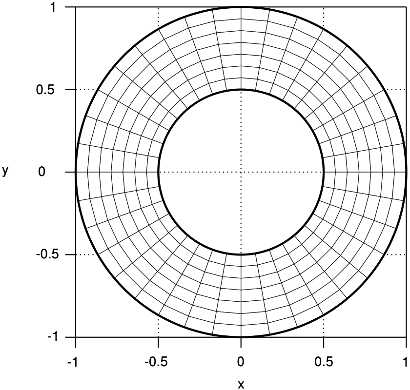
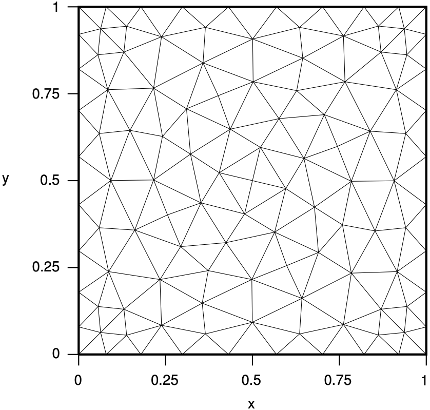
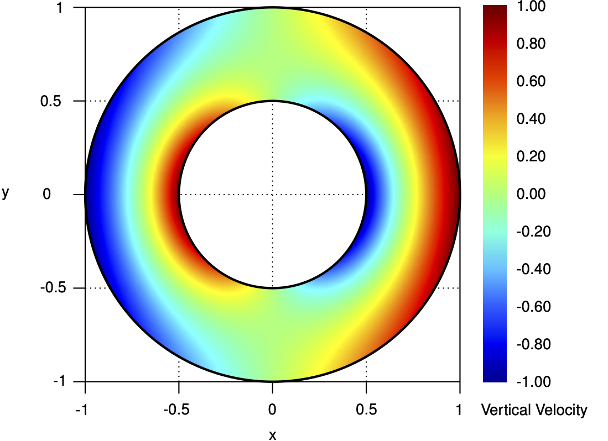

# [INSE_02] Taylor-Couette flow

## 1. Summary

This benchmark represents an **stationary two-dimensional isothermal incompressible fluid flow** problem confined between two infinitely long coaxial cylinders rotating at specific constant angular velocities. Since the cylinder lengths are assumed to be infinite, the flow occurs only along the azimuthal axis and, under these conditions, the flow has known analytic solutions for the pressure and velocity. It is particularly suitable for solvers of the **stationary Navier-Stokes equations** with solenoidal velocity fields. The case is based on an **exact analytical solution**, enabling:
- **Code verification** of numerical schemes for the Navier-Stokes equations.
- **Numerical assessment** of the incompressibility constraint and non-linear terms.
- **Convergence analysis** on structured and unstructured meshes.

> **NOTE:** For conciseness and readability, all functions are expressed in polar coordinates $\left(r,\theta\right)$, and vectors are represented in the unit polar basis $\lbrace\hat{\boldsymbol{r}},\hat{\boldsymbol{\theta}}\rbrace$. However, the codes generated from the symbolic expressions are implemented in Cartesian coordinates, ensuring direct applicability in numerical solvers.

## 2. Domain and meshes

The **domain**, $\Omega$, consists of an outer and inner concentric circular boundaries, $\Gamma^{\textrm{O}}$ and $\Gamma^{\textrm{I}}$, respectively, centred at the origin and with radius $r^{\textrm{O}}$ and $r^{\textrm{I}}$, respectively.

<div align="center">
  <table>
    <tr>
      <td align="center"></td>
      <td align="center"></td>
      <td align="center"></td>
    </tr>
    <tr>
      <td align="center">Domain and notation.</td>
      <td align="center">Structured quadrilateral mesh.</td>
      <td align="center">Unstructured triangular mesh.</td>
    </tr>
  </table>
</div>

**Structured quadrilateral** and **unstructured triangular meshes** with uniform mesh characteristic size are supplied to discretise both subdomains.

## 3. Model problem

The **stationary two-dimensional isothermal incompressible fluid flow** problem is modelled with the **Navier-Stokes equations** equipped with the appropriate boundary conditions, and reads: seek pressure and velocity functions, $p$ and $\boldsymbol{u}$, respectively, such that

$$
\begin{array}{ll}
&\left(\boldsymbol{u}\cdot\nabla\right)\boldsymbol{u}-\nu\nabla^{2}\boldsymbol{u}+\dfrac{1}{\rho}\nabla p=\boldsymbol{f},&\quad\textrm{in }\Omega,\\
&\nabla\cdot\boldsymbol{u}=0,&\quad\textrm{in }\Omega,
\end{array}
$$

where $\nu$ is the fluid constant kinetic viscosity, $\rho$ is the fluid constant density, and $\boldsymbol{f}$ is a source term function in $\Omega$.

## 4. Exact solutions

The **exact solutions** for the pressure and velocity read

$$
p\left(r,\theta\right)=\frac{a^{2}}{2}r^{2}+2ab\ln\left(r\right)-\frac{b^{2}}{2r^{2}}-c,\quad\text{in }\Omega,
$$

$$
\begin{array}{ll}
&u_{r}\left(r,\theta\right)=0,&\quad\quad\text{in }\Omega,\\
&u_{y}\left(r,\theta\right)=ar+\frac{b}{r},&\quad\quad\text{in }\Omega,
\end{array}
$$

where $c=\left.\left(c_{\textrm{E}}-c_{\textrm{I}}\right)\middle/\left(\pi\left(r^{2}_{\textrm{E}}-r^{2}_{\textrm{I}}\right)\right)\right.$ guarantees a null pressure mean-value in $\Omega$, and parameters $a$, $b$, $c_{\textrm{I}}$, and $c_{\textrm{E}}$ are are constant parameters given as

$$
\begin{array}{ll}
&a=\frac{\omega_{\textrm{E}}r^{2}_{\textrm{E}}-\omega_{\textrm{I}}r^{2}_{\textrm{I}}}{r^{2}_{\textrm{E}}-r^{2}_{\textrm{I}}},
\quad
&&b=\left(\omega_{\textrm{E}}-\omega_{\textrm{I}}\right)\frac{r^{2}_{\textrm{E}}r^{2}_{\textrm{I}}}{r^{2}_{\textrm{E}}-r^{2}_{\textrm{I}}},\\
&c_{\textrm{I}}=2\pi\left(\frac{a^{2}}{8}r^{4}_{\textrm{I}}+ab\left(\ln\left(r_{\textrm{I}}\right)-\frac{1}{2}\right)r^{2}_{\textrm{I}}-\frac{b^{2}}{2\ln\left(r_{\textrm{I}}\right)}\right),
\quad
&&c_{\textrm{E}}=2\pi\left(\frac{a^{2}}{8}r^{4}_{\textrm{E}}+ab\left(\ln\left(r_{\textrm{E}}\right)-\frac{1}{2}\right)r^{2}_{\textrm{E}}-\frac{b^{2}}{2\ln\left(r_{\textrm{E}}\right)}\right).
\end{array}
$$

<div align="center">
  <table>
    <tr>
      <td align="center"></td>
      <td align="center"></td>
    </tr>
    <tr>
      <td align="center">Pressure.</td>
      <td align="center">Velocity field.</td>
    </tr>
     <tr>
      <td align="center"></td>
      <td align="center"></td>
    </tr>
    <tr>
      <td align="center">Horizontal velocity.</td>
      <td align="center">Vertical velocity.</td>
    </tr>
  </table>
</div>

The **source term** vanishes for this exact solution, that is

$$
\begin{array}{ll}
&f_{x}\left(x,y\right)=0,&\quad\text{in }\Omega,\\
&f_{y}\left(x,y\right)=0,&\quad\text{in }\Omega.
\end{array}
$$

The **initial condition** for the velocity corresponds to the exact solution at time t=0, that is

$$
\begin{array}{ll}
&u_{x}\left(x,y\right)=u_{0}\sin\left(2\pi\alpha\dfrac{x}{L}\right)\cos\left(2\pi\alpha\dfrac{y}{L}\right),&\quad\forall x,y\in\left[0,L\right],\\
&u_{y}\left(x,y\right)=-u_{0}\cos\left(2\pi\alpha\dfrac{x}{L}\right)\sin\left(2\pi\alpha\dfrac{y}{L}\right),&\quad\forall x,y\in\left[0,L\right].
\end{array}
$$

The **boundary conditions** prescribed for both the pressure and velocity correspond to the **periodic boundary condition** on the four sides of the domain, considering the repetition of the solution in both directions, that is

$$
\begin{array}{ll}
&p(0,y,t)=p(L,y,t),&\quad\forall y\in\left[0,L\right],t>0,\\
&p(x,0,t)=p(x,L,t),&\quad\forall x\in\left[0,L\right],t>0,\\
&\boldsymbol{u}(0,y,t)=\boldsymbol{u}(L,y,t),&\quad\forall y\in\left[0,L\right],t>0,\\
&\boldsymbol{u}(x,0,t)=\boldsymbol{u}(x,L,t),&\quad\forall x\in\left[0,L\right],t>0.
\end{array}
$$

> **NOTE:** The problem can also be solved with symmetry boundary conditions imposed on the domain edges (symmetry or antisymmetry depending on the velocity components). However, the canonical and most commonly employed formulation remains the use of periodic boundary conditions in all directions.

> **NOTE:** The problem can also be easily converted into a stationary problem with the analytical solution corresponding to the previous solution at a fixed time. Considering $t=0$, the **exact solutions** for the pressure and velocity read
>
>$$
>p\left(x,y\right)=\dfrac{\rho u^{2}_{0}}{4}\left(\cos\left(4\pi\alpha\dfrac{x}{L}\right)+\cos\left(4\pi\alpha\dfrac{y}{L}\right)\right),\quad\text{in }\Omega,
>$$
>
>$$
>\begin{array}{ll}
>&u_{x}\left(x,y\right)=u_{0}\sin\left(2\pi\alpha\dfrac{x}{L}\right)\cos\left(2\pi\alpha\dfrac{y}{L}\right),&\quad\quad\text{in }\Omega,\\
>&u_{y}\left(x,y\right)=-u_{0}\cos\left(2\pi\alpha\dfrac{x}{L}\right)\sin\left(2\pi\alpha\dfrac{y}{L}\right),&\quad\quad\text{in }\Omega.
>\end{array}
>$$
>
> In that case, the source term does not vanish to prevent the vortices from decaying, and reads
>
>$$
>\begin{array}{ll}
>&f_{x}\left(x,y\right)=u_{0}\dfrac{8\pi^{2}\alpha^{2}\mu}{\rho L^{2}}\sin\left(2\pi\alpha\dfrac{x}{L}\right)\cos\left(2\pi\alpha\dfrac{y}{L}\right),&\quad\text{in }\Omega,\\
>&f_{y}\left(x,y\right)=-u_{0}\dfrac{8\pi^{2}\alpha^{2}\mu}{\rho L^{2}}\cos\left(2\pi\alpha\dfrac{x}{L}\right)\sin\left(2\pi\alpha\dfrac{y}{L}\right),&\quad\text{in }\Omega.
>\end{array}
>$$
>
> The **boundary conditions** prescribed for both the pressure and velocity are the same as in the unsteady case.

## 5. Case parameters

The table below summarises the given constant parameters and the recommended values for two case configurations: a low Reynolds number ($Re=1$) and a high Reynolds number ($Re=100$).

| Symbol                    | Description                                                       | Value (low Reynolds number)   | Value (high Reynolds number)   | Units              |
|:--------------------------|:------------------------------------------------------------------|------------------------------:|-------------------------------:|:-------------------|
| $L$                       | Domain length                                                     | 1.0                           | 1.0                            | m                  |
| $T$                       | Final time                                                        | 1.0                           | 1.0                            | s                  |
| $\nu$                     | Fluid kinetic viscosity                                           | 1.0                           | 1.0                            | m<sup>2</sup>/s    |
| $\rho$                    | Fluid density                                                     | 1.0                           | 1.0                            | kg/m<sup>3</sup>   |
| $u_{0}$                   | Reference velocity                                                | 1.0                           | 100.0                          | m/s                |
| $\alpha$                  | Vortex frequency                                                  | 2                             | 2                              |                    |

## 6. Scripts and files

The table below summarises the functionality and usage of the supplied scripts. Check script headers for requirements and dependencies.

| File                        | Description                                                                     | Usage (command-line)          |
|:----------------------------|:--------------------------------------------------------------------------------|:------------------------------|
| `generate_quadmesh.msh` | Generates quadrilateral structured meshes in MSH format. Mesh refinement can be controlled through the command-line option `-setnumber N <value>` where `<value>` is a numerical argument specifying the desired refinement level (default: `1`). Outputs are saved in `meshes/`. | `gmsh -setnumber N 1 generate_quadmesh.msh` |
| `generate_triamesh.msh` | Generates triangular unstructured meshes in MSH format. Mesh refinement can be controlled through the command-line option `-setnumber N <value>` where `<value>` is a numerical argument specifying the desired refinement level (default: `1`). Outputs are saved in `meshes/`. | `gmsh -setnumber N 1 generate_triamesh.msh` |
| `generate_code.py` | Generates code for the symbolic expressions of parameters and functions in multiple programming languages: C/C++, Fortran, Octave/Matlab, and Python. Outputs are saved in `codes/`. | `python generate_code.py` |
| `helpers.py` | Utility functions for code generation in multiple programming languages: C/C++, Fortran, Octave/Matlab, and Python. Includes code formatting and line-wrapping helpers to keep generated source code within a configurable indent and line width. | |

## 7. How to cite

If you have used this benchmark or supplied material — in its original or modified form, in part or in whole — in your research, please acknowledge the original work when publishing your results:

> **R. Costa**, S. Clain, G.J. Machado, and J.M. Nóbrega, _Very high-order accurate finite volume method for the steady-state incompressible Navier-Stokes equations with polygonal meshes on arbitrary curved boundaries_, **Computer Methods in Applied Mechanics and Engineering**, Vol. 396, 115064, 2022. DOI: [10.1016/j.cma.2022.115064](https://doi.org/10.1016/j.cma.2022.115064).

For your convenience, you may use the following BibTeX entry:

```bibtex
@article{Costa2022,
  title={Very high-order accurate finite volume method for the steady-state incompressible Navier-Stokes equations with polygonal meshes on arbitrary curved boundaries},
  author={Costa, R. and Clain, S. and Machado, G. J. and Nóbrega, J. M.},
  journal={Computer Methods in Applied Mechanics and Engineering},
  volume={396},
  pages={115064},
  year={2022},
  doi={10.1016/j.cma.2022.115064}
}
```
