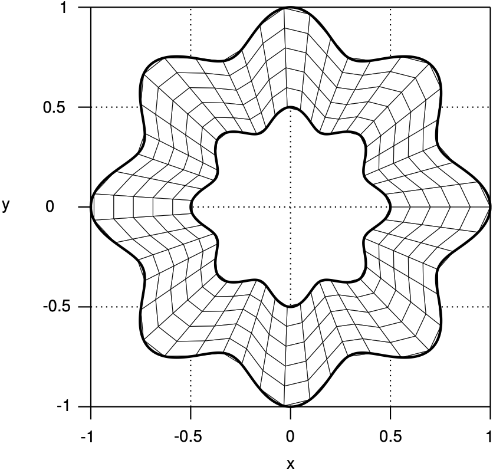
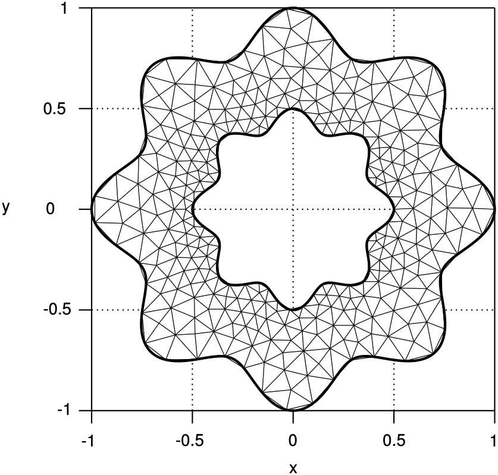
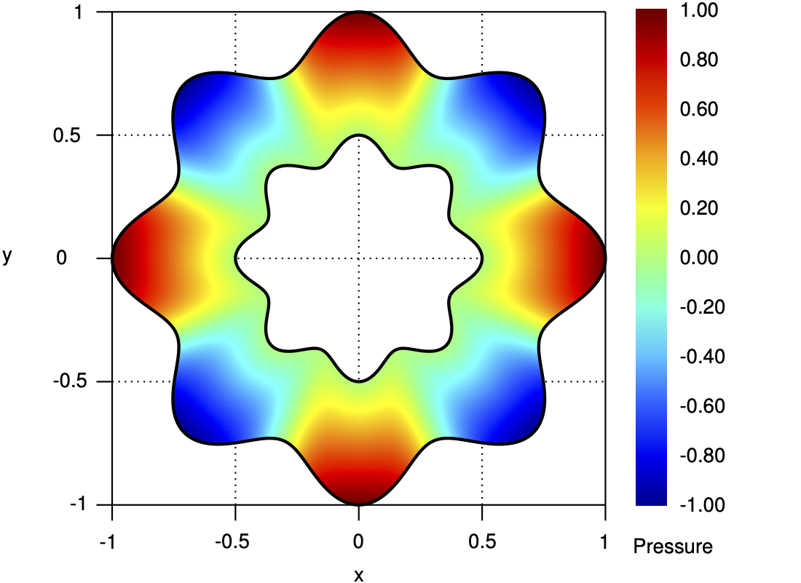
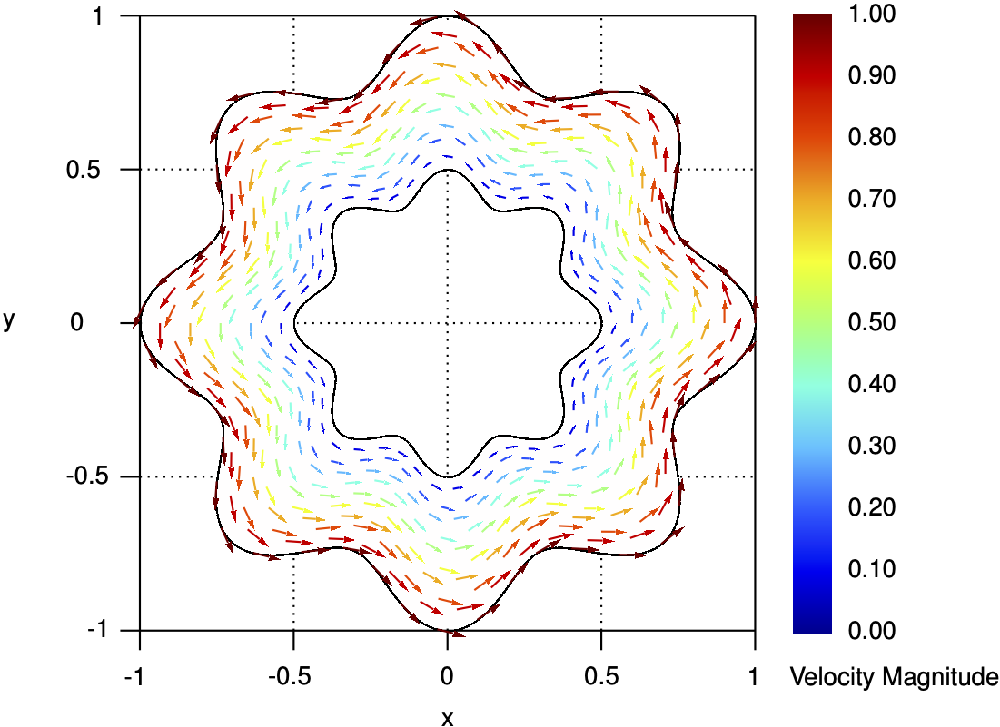
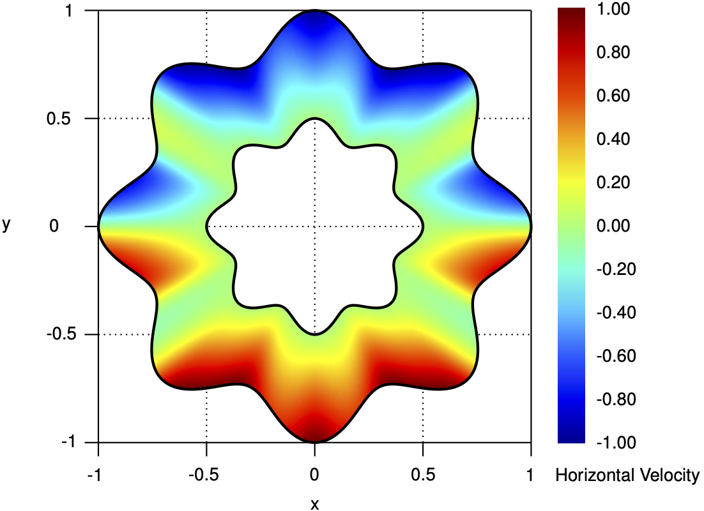
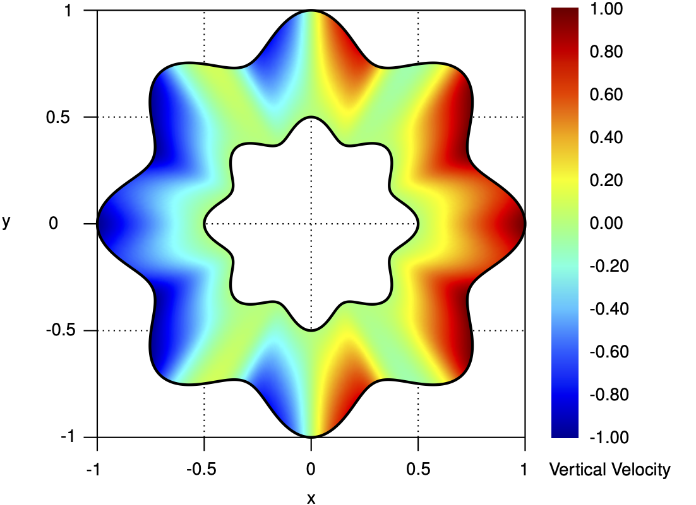

# [INSE_04] Flow between rose-shaped boundaries

## 1. Summary

This benchmark represents a **stationary two-dimensional isothermal incompressible fluid flow** problem with vorticies confined between two rose-shaped boundaries. It is particularly suitable for solvers of the **stationary Navier-Stokes equations** with solenoidal velocity fields. The case is based on a **manufactured analytical solution** in polar coordinates, enabling:
- **Code verification** of numerical schemes for the Navier-Stokes equations.
- **Numerical assessment** of the incompressibility constraint and non-linear terms.
- **Convergence analysis** on structured and unstructured meshes.

> **NOTE:** For conciseness and readability, all functions are expressed in polar coordinates $\left(r,\theta\right)$, and vectors are represented in the unit polar basis $\lbrace\hat{\boldsymbol{r}},\hat{\boldsymbol{\theta}}\rbrace$. However, the codes generated from the symbolic expressions are implemented in Cartesian coordinates, ensuring direct applicability in numerical solvers.

## 2. Domain and meshes

The **domain**, $\Omega$, consists of an outer and inner concentric boundaries, $\Gamma^{\textrm{O}}$ and $\Gamma^{\textrm{I}}$, respectively, centred at the origin and with variable radius, $R^{\textrm{O}}$ and $R^{\textrm{O}}$, respectively. The outer and inner boundaries correspond to a periodic perturbation (diffeomorphic transformation) applied to a circumference centred at the origin with radius $r^{\textrm{O}}$ and $r^{\textrm{I}}$, respectively, and read

$$
\begin{array}{ll}
&R^{\textrm{O}}\left(\theta\right)=r^{\textrm{O}}\left(1+\beta_{1}^{\textrm{O}}\cos\left(\beta_{2}^{\textrm{O}}\theta\right)\right),\\
&R^{\textrm{I}}\left(\theta\right)=r^{\textrm{I}}\left(1+\beta_{1}^{\textrm{I}}\cos\left(\beta_{2}^{\textrm{I}}\theta\right)\right),
\end{array}
$$

where $\beta_{1}^{\textrm{O}}$ and $\beta_{1}^{\textrm{I}}$ are constant parameters to control the perturbation magnitude, while $\beta_{2}^{\textrm{O}}$ and $\beta_{2}^{\textrm{I}}$ are constant parameters to control the periodicity.

Vector functions $\boldsymbol{n}^{\textrm{O}}$ and $\boldsymbol{n}^{\textrm{I}}$ correspond to the outward unit normal vectors on boundaries $\Gamma^{\textrm{O}}$ and $\Gamma^{\textrm{I}}$, respectively, and reads

$$
\boldsymbol{n}^{\textrm{O}}\left(\theta\right)=\dfrac{R^{\textrm{O}}\left(\theta\right)\hspace{1pt}\hat{\boldsymbol{r}}-\dfrac{\textrm{d}R^{\textrm{O}}\left(\theta\right)}{\textrm{d}\theta}\hat{\boldsymbol{\theta}}}{\sqrt{\left(R^{\textrm{O}}\left(\theta\right)\right)^{2}+\left(\dfrac{\textrm{d}R^{\textrm{O}}\left(\theta\right)}{\textrm{d}\theta}\right)^{2}}}\\
=\dfrac{\left(1+\beta_{1}^{\textrm{O}}\cos\left(\beta_{2}^{\textrm{O}}\theta\right)\right)\hat{\boldsymbol{r}}+\beta_{1}^{\textrm{O}}\beta_{2}^{\textrm{O}}\sin\left(\beta_{2}^{\textrm{O}}\theta\right)\hat{\boldsymbol{\theta}}}{\sqrt{\left(\beta_{1}^{\textrm{O}}\right)^{2}\left(\beta_{2}^{\textrm{O}}\right)^{2}\sin^{2}\left(\beta_{2}^{\textrm{O}}\theta\right)+\left(\beta_{1}^{\textrm{O}}\right)^{2}\cos^{2}\left(\beta_{2}^{\textrm{O}}\theta\right)+2\beta_{1}^{\textrm{O}}\cos\left(\beta_{2}^{\textrm{O}}\theta\right)+1}},
$$

$$
\boldsymbol{n}^{\textrm{I}}\left(\theta\right)=\dfrac{\-R^{\textrm{I}}\left(\theta\right)\hspace{1pt}\hat{\boldsymbol{r}}+\dfrac{\textrm{d}R^{\textrm{I}}\left(\theta\right)}{\textrm{d}\theta}\hat{\boldsymbol{\theta}}}{\sqrt{\left(R^{\textrm{I}}\left(\theta\right)\right)^{2}+\left(\dfrac{\textrm{d}R^{\textrm{I}}\left(\theta\right)}{\textrm{d}\theta}\right)^{2}}}\\
=-\dfrac{\left(1+\beta_{1}^{\textrm{I}}\cos\left(\beta_{2}^{\textrm{I}}\theta\right)\right)\hat{\boldsymbol{r}}+\beta_{1}^{\textrm{I}}\beta_{2}^{\textrm{I}}\sin\left(\beta_{2}^{\textrm{I}}\theta\right)\hat{\boldsymbol{\theta}}}{\sqrt{\left(\beta_{1}^{\textrm{I}}\right)^{2}\left(\beta_{2}^{\textrm{I}}\right)^{2}\sin^{2}\left(\beta_{2}^{\textrm{I}}\theta\right)+\left(\beta_{1}^{\textrm{I}}\right)^{2}\cos^{2}\left(\beta_{2}^{\textrm{I}}\theta\right)+2\beta_{1}^{\textrm{I}}\cos\left(\beta_{2}^{\textrm{I}}\theta\right)+1}}.
$$

<div align="center">
  <table>
    <tr>
      <td align="center"></td>
      <td align="center"></td>
      <td align="center"></td>
    </tr>
    <tr>
      <td align="center">Domain and notation.</td>
      <td align="center">Structured quadrilateral mesh.</td>
      <td align="center">Unstructured triangular mesh.</td>
    </tr>
  </table>
</div>

**Structured quadrilateral** and **unstructured triangular meshes** with uniform mesh characteristic size are supplied to discretise both subdomains.

## 3. Model problem

The **stationary two-dimensional isothermal incompressible fluid flow** problem is modelled with the **Navier-Stokes equations** equipped with the appropriate boundary conditions, and reads: seek pressure and velocity functions, $p$ and $\boldsymbol{u}$, respectively, such that

$$
\begin{array}{ll}
&\left(\boldsymbol{u}\cdot\nabla\right)\boldsymbol{u}-\nu\nabla^{2}\boldsymbol{u}+\dfrac{1}{\rho}\nabla p=\boldsymbol{f},&\quad\textrm{in }\Omega,\\
&\nabla\cdot\boldsymbol{u}=0,&\quad\textrm{in }\Omega,
\end{array}
$$

where $\nu$ is the fluid constant kinetic viscosity, $\rho$ is the fluid constant density, and $\boldsymbol{f}$ is a source term function in $\Omega$.

## 4. Manufactured solutions

The **manufactured solutions** for the pressure and velocity read

$$
\begin{array}{ll}
&p\left(r,\theta\right)=\rho\left(\dfrac{r-R^{\textrm{I}}\left(\theta\right)}{R^{\textrm{O}}\left(\theta\right)-R^{\textrm{I}}\left(\theta\right)}\right)\cos\left(n\theta\right),&\quad\text{in }\Omega,\\
&u_{r}\left(r,\theta\right)=u_{0}\left(\dfrac{r-R^{\textrm{I}}\left(\theta\right)}{R^{\textrm{O}}\left(\theta\right)-R^{\textrm{I}}\left(\theta\right)}\right)\dfrac{\dfrac{\textrm{d}R^{\textrm{O}}\left(\theta\right)}{\textrm{d}\theta}}{\sqrt{\left(\dfrac{\textrm{d}R^{\textrm{O}}\left(\theta\right)}{\textrm{d}\theta}\right)^{2}+\left(R^{\textrm{O}}\left(\theta\right)\right)^{2}}}
,&\quad\text{in }\Omega,\\
&u_{\theta}\left(r,\theta\right)=u_{0}\left(\dfrac{r-R^{\textrm{I}}\left(\theta\right)}{R^{\textrm{O}}\left(\theta\right)-R^{\textrm{I}}\left(\theta\right)}\right)\dfrac{R^{\textrm{O}}\left(\theta\right)}{\sqrt{\left(\dfrac{\textrm{d}R^{\textrm{O}}\left(\theta\right)}{\textrm{d}\theta}\right)^{2}+\left(R^{\textrm{O}}\left(\theta\right)\right)^{2}}},&\quad\text{in }\Omega,
\end{array}
$$

where $u_{0}$ is the reference velocity and $n$ is the pressure mode number (angular complexity).

<div align="center">
  <table>
    <tr>
      <td align="center"></td>
      <td align="center"></td>
    </tr>
    <tr>
      <td align="center">Pressure.</td>
      <td align="center">Velocity field.</td>
    </tr>
     <tr>
      <td align="center"></td>
      <td align="center"></td>
    </tr>
    <tr>
      <td align="center">Horizontal velocity.</td>
      <td align="center">Vertical velocity.</td>
    </tr>
  </table>
</div>

The **source terms** are obtained from substituting the manufactured solutions into the governing equations in polar coordinates. Due to the complexity of the manufactured solutions, the resulting analytical functions for the source term are intricate and are omitted for conciseness.

The **boundary conditions** prescribed for both the velocity correspond to the **Dirichlet boundary condition** on the outer and inner boundaries, considering the prescribed angular velocities, that is

$$
\begin{array}{ll}
&u_{r}\left(r,\theta\right)=\dfrac{\beta_{1}^{\textrm{O}}\beta_{2}^{\textrm{O}}\sin\left(\beta_{2}^{\textrm{O}}\theta\right)}{\sqrt{\left(\beta_{1}^{\textrm{O}}\right)^{2}\left(\beta_{2}^{\textrm{O}}\right)^{2}\sin^{2}\left(\beta_{2}^{\textrm{O}}\theta\right)+\left(\beta_{1}^{\textrm{O}}\right)^{2}\cos^{2}\left(\beta_{2}^{\textrm{O}}\theta\right)+2\beta_{1}^{\textrm{O}}\cos\left(\beta_{2}^{\textrm{O}}\theta\right)+1}},&\quad\text{on }\Gamma^{\textrm{O}},\\
&u_{\theta}\left(r,\theta\right)=\dfrac{1+\beta_{1}^{\textrm{O}}\cos\left(\beta_{2}^{\textrm{O}}\theta\right)}{\sqrt{\left(\beta_{1}^{\textrm{O}}\right)^{2}\left(\beta_{2}^{\textrm{O}}\right)^{2}\sin^{2}\left(\beta_{2}^{\textrm{O}}\theta\right)+\left(\beta_{1}^{\textrm{O}}\right)^{2}\cos^{2}\left(\beta_{2}^{\textrm{O}}\theta\right)+2\beta_{1}^{\textrm{O}}\cos\left(\beta_{2}^{\textrm{O}}\theta\right)+1}},&\quad\text{on }\Gamma^{\textrm{O}},\\
&u_{r}\left(r,\theta\right)=0,&\quad\text{on }\Gamma^{\textrm{I}},\\
&u_{\theta}\left(r,\theta\right)=0,&\quad\text{on }\Gamma^{\textrm{I}}.\\
\end{array}
$$

## 5. Case parameters

The table below summarises the given constant parameters and the recommended values for two case configurations: a low Reynolds number ($Re=1$) and a high Reynolds number ($Re=100$).

| Symbol                    | Description                                                       | Value (low Reynolds number)   | Value (high Reynolds number)   | Units              |
|:--------------------------|:------------------------------------------------------------------|------------------------------:|-------------------------------:|:-------------------|
| $r^{\textrm{O}}$          | Radius of outer boundary                                          | 1.0                           | 1.0                            | m                  |
| $r^{\textrm{I}}$          | Radius of inner boundary                                          | 0.5                           | 0.5                            | m                  |
| $\beta_{1}^{\textrm{O}}$  | Magnitude of outer boundary perturbation                          | 0.1                           | 0.1                            |                    |
| $\beta_{2}^{\textrm{O}}$  | Periodicity of outer boundary perturbation                        | 8.0                           | 8.0                            |                    |
| $\beta_{1}^{\textrm{I}}$  | Magnitude of inner boundary perturbation                          | 0.1                           | 0.1                            |                    |
| $\beta_{2}^{\textrm{I}}$  | Periodicity of inner boundary perturbation                        | 8.0                           | 8.0                            |                    |
| $\nu$                     | Fluid kinetic viscosity                                           | 1.0                           | 1.0                            | m<sup>2</sup>/s    |
| $\rho$                    | Fluid density                                                     | 1.0                           | 1.0                            | kg/m<sup>3</sup>   |
| $u_{0}$                   | Reference velocity                                                | 1.0                           | 100.0                          | m/s                |
| $n$                       | Pressure mode number                                              | 4                             | 4                              |                    |

## 6. Scripts and files

The table below summarises the functionality and usage of the supplied scripts. Check script headers for requirements and dependencies.

| File                        | Description                                                                     | Usage (command-line)          |
|:----------------------------|:--------------------------------------------------------------------------------|:------------------------------|
| `generate_quadmesh.msh` | Generates quadrilateral structured meshes in MSH format. Mesh refinement can be controlled through the command-line option `-setnumber N <value>` where `<value>` is a numerical argument specifying the desired refinement level (default: `1`). Outputs are saved in `meshes/`. | `gmsh -setnumber N 1 generate_quadmesh.msh` |
| `generate_triamesh.msh` | Generates triangular unstructured meshes in MSH format. Mesh refinement can be controlled through the command-line option `-setnumber N <value>` where `<value>` is a numerical argument specifying the desired refinement level (default: `1`). Outputs are saved in `meshes/`. | `gmsh -setnumber N 1 generate_triamesh.msh` |
| `generate_code.py` | Generates code for the symbolic expressions of parameters and functions in multiple programming languages: C/C++, Fortran, Octave/Matlab, and Python. Outputs are saved in `codes/`. | `python generate_code.py` |
| `helpers.py` | Utility functions for code generation in multiple programming languages: C/C++, Fortran, Octave/Matlab, and Python. Includes code formatting and line-wrapping helpers to keep generated source code within a configurable indent and line width. | |

## 7. How to cite

If you have used this benchmark or supplied material — in its original or modified form, in part or in whole — in your research, please acknowledge the original work when publishing your results:

> **R. Costa**, S. Clain, G.J. Machado, and J.M. Nóbrega, _Very high-order accurate finite volume method for the steady-state incompressible Navier-Stokes equations with polygonal meshes on arbitrary curved boundaries_, **Computer Methods in Applied Mechanics and Engineering**, Vol. 396, 115064, 2022. DOI: [10.1016/j.cma.2022.115064](https://doi.org/10.1016/j.cma.2022.115064).

For your convenience, you may use the following BibTeX entry:

```bibtex
@article{Costa2022,
  title={Very high-order accurate finite volume method for the steady-state incompressible Navier-Stokes equations with polygonal meshes on arbitrary curved boundaries},
  author={Costa, R. and Clain, S. and Machado, G. J. and Nóbrega, J. M.},
  journal={Computer Methods in Applied Mechanics and Engineering},
  volume={396},
  pages={115064},
  year={2022},
  doi={10.1016/j.cma.2022.115064}
}
```
